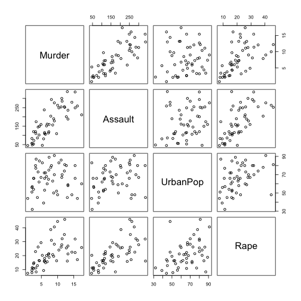

Data Products Class Presentation
========================================================
author: Damien Edwards
date: 3/22/2015

Overview
========================================================

The Shiny app for this project complets a K-means cluter display for the Violent Crime Rate Arrests per 100,000 residents for assault,murder and rape in 1973.


- Visit https://edamiee.shinyapps.io/Project/
- Click the X axis variable dropdown to select Violent Crime Arrest type
- Click the Y axis variable dropdown to select Violent Crime Arrest type
- Select the number of k-means clusters that you want to cluster the Crime type

Purpose of Application
========================================================
The application uses K-means clustering to provide the user with exploratory analysis of clustering of the Violent Crime types in 1973. By clustering the Violent Crime types, law officials are able to use the application to start future preventive methods for the Violent Crimes.

US Arrests data
========================================================


```
           Murder Assault UrbanPop Rape
Alabama      13.2     236       58 21.2
Alaska       10.0     263       48 44.5
Arizona       8.1     294       80 31.0
Arkansas      8.8     190       50 19.5
California    9.0     276       91 40.6
Colorado      7.9     204       78 38.7
```

Plot of US Arrests data
========================================================

 

DataSet Referenced
========================================================
- http://stat.ethz.ch/R-manual/R-patched/library/datasets/html/USArrests.html
-
Current Time Viewed presentation:

```
[1] "Sun Mar 22 12:46:11 2015"
```

